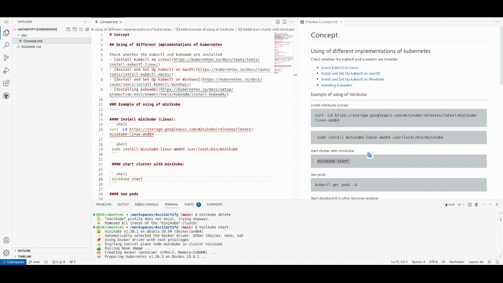

# Concept

## Using of different implementations of kubernetes

Running the standard k8s clusters in local environments requires much operational effort and system resources. This is why Developers, DevOps engineers, and other professionals who, for reasons such as development, testing, or learning, prefer to run Kubernetes local refer to tools and distributions built for this purpose.

Check whether the kubectl and kubeadm are installed
- [install kubectl on Linux](https://kubernetes.io/docs/tasks/tools/install-kubectl-linux/)
- [Install and Set Up kubectl on macOS](https://kubernetes.io/docs/tasks/tools/install-kubectl-macos/)
- [Install and Set Up kubectl on Windows](https://kubernetes.io/docs/tasks/tools/install-kubectl-windows/)
- [Installing kubeadm](https://kubernetes.io/docs/setup/production-environment/tools/kubeadm/install-kubeadm/)

## Comparision

**Minikube** - Jack of all platform-trades
A very important difference between minikube and all other contestants is that it can deploy Kubernetes clusters with one of the multiple drivers. These drivers implement the way you run the Kubernetes cluster on a development machine: either based in a virtual machine (for example Hyper-V, KVM2, QEMU, or others) or in a container runtime (for example with Docker or Podman). When looking at minikube with the evaluation aspects from above, one can spot differences in the details between these drivers. Yet, in general, minikube abstracts the driver's implementation for the developer.

Hence, it’s more than likely that minikube can run Kubernetes for virtually any platform a developer is working on. Coming with a unified interface, minikube is a very platform-agnostic solution. If your team is working with Windows, macOS, Linux, or even more exotic platforms, it’s a great benefit to have all members use the same tool. They will be able to share knowledge more easily, provide scripts for automation and write documentation that covers all platforms equally.

A big plus for minikube is its comprehensive documentation. It not only contains technical references but also a long list of tutorials for many specific use cases and deployment scenarios.

**Use all K8s features with minikube**.
With minikube a developer can use practically any required Kubernetes feature. Some of them must be enabled with the –feature-gates flag. This is a set of key-value pairs that describe feature gates for experimental features. Other features are controlled by the addons system of minikube. Addons can be integrated by 3rd party vendors. Here is a list of addons from my system.

**Minikube Profiles**: multiple logical clusters on one dev machine
When we started adopting Kubernetes, we were looking for a solution that allowed us to manage multiple logical clusters on one development machine. In 2016/2017, minikube did not put much focus on that particular feature. It was only possible to spin up one cluster per machine, and there was only a single-node cluster configuration possible. That is why one often decided to work with k3d. However, minikube caught up with this important developer feature and does now support multiple so-called minikube profiles.

**kind**
Just like k3d, kind also provides the possibility to use configuration files. Platform depend. It is also demanding on resources, uses k8s clusters.
kind is very similar to k3d in most aspects. Just like k3d and minikube, you can install it using popular packet managers, scripts and as a single executable.
If you know the handling of the k3d CLI already, you will probably be used to kind’s CLI very fast. The options are almost identical, and so are the limitations.
There is nothing much to add in this section.

**k3d**
k3d is more limited when it comes to deploying it on a development machine. From the very beginning, k3d only supported a local container runtime for running the Kubernetes cluster. It was always possible to manage multiple separate clusters for development on one host. That was a real killer feature, especially for running multiple different Kubernetes projects for several clients. One great advantage that k3d provides (which minikube misses at this point) is that k3d provides a cluster configuration file (as of version 4.0.0). It allows development teams to persist the configuration of a k3d cluster to a local YAML file that can be shared across the team.  k3d is based on k3s, a lightweight Kubernetes solution that is developed by Rancher. However, k3d is not deeply affiliated with k3s and is driven by a community of developers.


| Implementation |  Description                                                              | advantages                                                             |disadvantages                      |
|----------------|:-------------------------------------------------------------------------:|:-----------------------------------------------------------------------|:----------------------------------|
|`minikube`      | works either on virtual machine or in a container runtime (podman/docker) | Universal, good for learning uses a lot of features from k8s, dashboard|demanding on resources, scalability is complex, cluster is without  config files, universal platform|
| `kid`          | "kubernetes in docker", supports podman, works with real k8s clusters     | scalability: multiple server/nodes ,local development, k8s clusters, good for testing CI/CD pipelines | demanding on resources, more complex for local development, platform depend|
| `k3d`          | resource optimised kubernetes, "all in one binary file", implementation of k3s interface| scalable, good with local development, optimal by resources  consuming, similiar with k8s, easy to install|not a real k8s cluster               |

### **Comclusions:**

Of these three tools for deploying and developing Kubernetes clusters in an on-premises environment (for using it as PoC) most suitable is k3d, because of resource consumption, easy installing and similarity with k8s

### Example of using of minikube
----

#### Install minikube (Linux):
```shell
curl -LO https://storage.googleapis.com/minikube/releases/latest/minikube-linux-amd64
```
```shell
 sudo install minikube-linux-amd64 /usr/local/bin/minikube
 ```

 #### start cluster with minikube:

 

```shell
 minikube start
 ```

#### See pods

```shell
kubectl get pods -A
```

#### Start dashboard in other terminal window

```shell
minikube dashboard
```

#### Deploying and Testing a Sample App

```shell
kubectl create deployment web --image=gcr.io/google-samples/hello-app:1.0
```

#### Next, expose the web deployment as a Kubernetes Service, specifying a static port where it will be accessible with ```--type=NodePort``` and ```--port=8080```:
```shell
kubectl expose deployment web --type=NodePort --port=8080
```

#### check whether the service is running

```shell
kubectl get service web
```

#### Now you can use minikube to retrieve a URL that is accessible outside of the container. This URL will allow you to access the hello-app service that is running on port 8080 inside your cluster:

```shell
curl $(minikube service web --url)
```

#### Remove deployment:
```shell
kubectl delete deployment web
```

#### Remove cluster:
```shell
minikube delete
```
-----